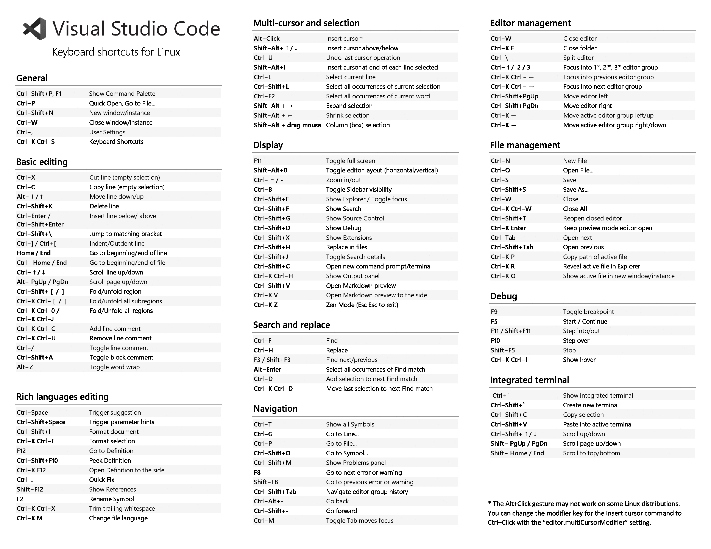

## Visual Studio Code - lesson 1

### Keyboad shortcuts for linux

these are some default shortcuts, also its totally possible customize.

### Customization

There are many things you can do to customize VS Code.

- Change your theme
- Change your keyboard shortcuts
- Tune your settings
- Add JSON validation
- Create snippets
- install extensions

### Creating my own extension

its also possible create your own extension.

- configuration
- commands
- keybindings
- languages
- debuggers
- grammars
- themes
- snippets
- jsonValidation

fonts: https://github.com/Microsoft/vscode-docs/blob/master/docs/getstarted/tips-and-tricks.md